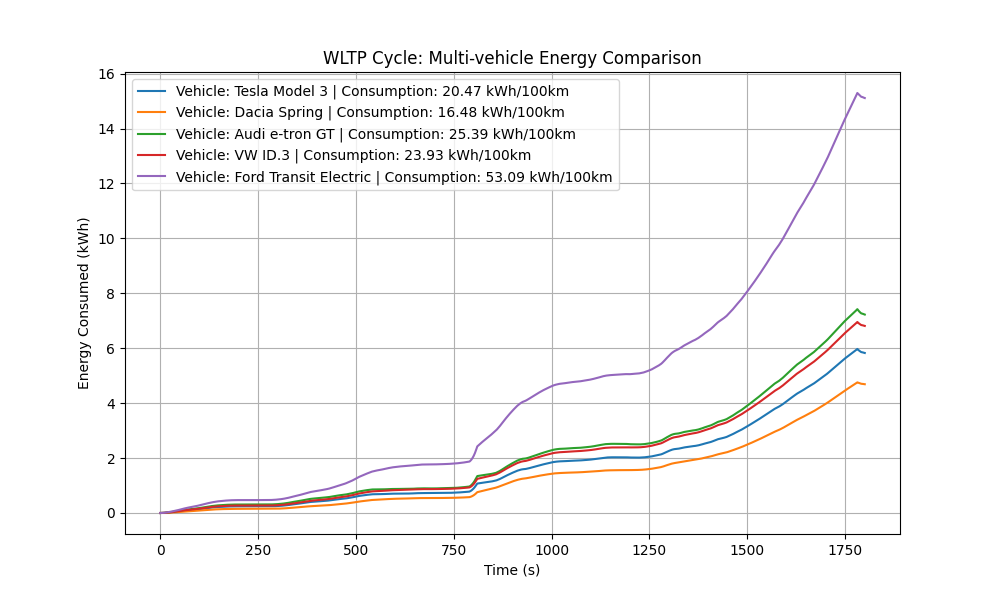
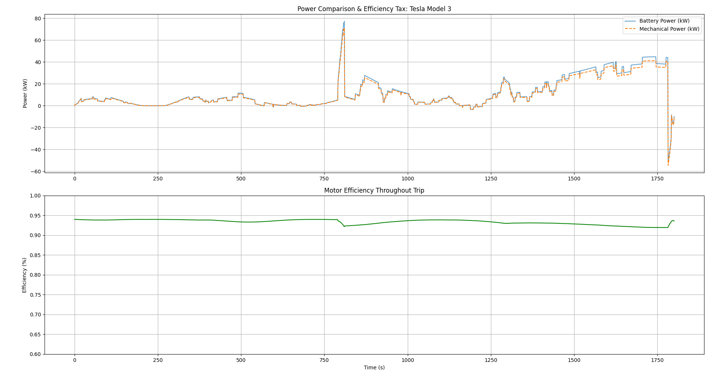

# 🚗 Vehicle Energy & Driving Analysis Tool (v2.0)

A modular Python-based framework designed to simulate real-world energy consumption and range for Electric Vehicles (EVs). I used a 1D longitudinal physics engine combined with a non-linear powertrain efficiency model to benchmark different vehicle architectures across standardized driving cycles.

## 🌟 Key Features
- **Longitudinal Physics Engine:** Calculates instantaneous forces including aerodynamic drag, rolling resistance, gradient force (road slope), and inertial acceleration force.
- **Terrain-Aware Simulation:** Integrates a "random walk" road gradient model to simulate real-world elevation changes.
- **Powertrain Modeling:**
  - Calculates motor RPM and torque based on gear ratios and wheel radious.
  - Implements a non-linear motor efficiency map to simulate heat losses during traction and regenerative braking.
- **Standardized Benchmarking:** Uses a WLTP-like driving cycle (urban, suburban, rural, and highway phases).
- **JSON-Driven Architecture:** Easily expandable vehicle database.

## 📊 Benchmarking Results (v2.0)
The following results were generated using a 30-minute WLTP cycle with integrated 4% maximum road gradients.

| Vehicle | Consumption (kWh/100km) | Heat Loss (%) | Battery Size | Predicted Range |
|---------|-------------------------|--------------|--------------|----------------|
| Tesla Model 3 | 20.4 | 7.6% | 75.0 kWh | 366.4 km |
| Audi e-tron GT | 25.3 | 7.4% | 97.0 kWh | 382.1 km |
| VW ID.3 | 23.9 | 7.4% | 77.0 kWh | 321.7 km |
| Dacia Spring | 16.4 | 8.0% | 26.8 kWh | 162.7 km |
| Ford Transit Electric | 53.0 | 7.3% | 68.0 kWh | 128.1 km |

## 🔍 Engineering Insights
- **Aerodynamic Sensitivity:** The Ford Transit demonstrates the massive impact of frontal area ($5.4m^2$) on highway energy consumption, consuming nearly *2.5 times* more energy than the Tesla Model 3.
- **The Efficiency Tax:** The Dacia Spring shows the highest heat loss percentage (8%). This is attributed to its smaller wheel radius, requiring higher motor RPMs to maintain highway speeds, pushing the motor outside its peak efficiency "island." 
- **Mass vs. Efficiency:** While the Audi e-tron GT is the heaviest in the fleet, its superior aerodynamics and large battery allow it to maintain the highest total range despite a high consumption rate.

## 🛠️ Tech Stack & Methodology
- **Language:** Python 3.x
- **Data Processing:** pandas, numpy *(Vectorized calculations for high performance)*
- **Visualization:** matplotlib
- **Physics Logic:**

Drag Force: 
$F_d = \frac{1}{2} \rho v^2 C_d A$

Rolling Resistance:
$F_{rr} = C_{rr} m g \cos(\theta)$

Gradient Force: 
$F_g = m g \sin(\theta)$

Battery Power: Calculated as $P_{wheels} / \eta_{motor}$ during traction and $P_{wheels} \cdot \eta_{motor}$ during regeneration.

Rolling Resistance: F_{rr} = C_{rr} m g  (	heta)
Gradient Force: F_g = m g  (	heta)
battery Power: Calculated as P_{wheels} / ta_{motor} during traction and P_{wheels} ta_{motor} during regeneration.

## 🚀 How to Run
1. Clone the repository.
2. Install dependencies:
pip install pandas numpy matplotlib
3. Run the analysis:
printf main.py